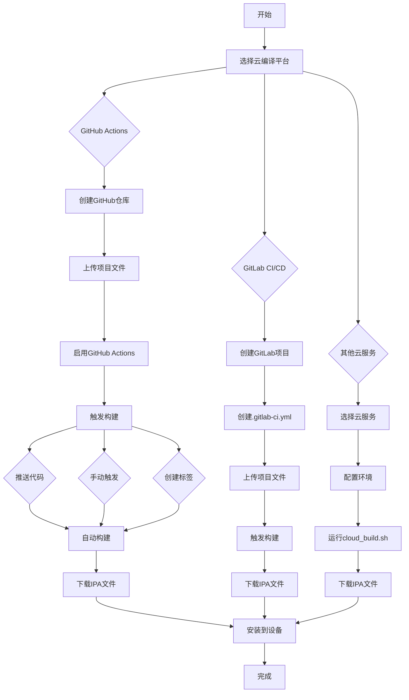

# ZipMaster Pro - 云编译流程图

## 🚀 云编译完整流程



## 📋 详细步骤说明

### 1. 准备工作
```bash
# 1. 创建GitHub账户
# 访问 https://github.com

# 2. 创建新仓库
# 命名为 "ZipMasterPro"

# 3. 上传项目文件
git init
git add .
git commit -m "Initial commit"
git branch -M main
git remote add origin https://github.com/YOUR_USERNAME/ZipMasterPro.git
git push -u origin main
```

### 2. 启用GitHub Actions
```bash
# 无需额外配置
# 工作流文件已包含在项目中
# .github/workflows/build.yml
# .github/workflows/build-ipa.yml
# .github/workflows/quick-build.yml
```

### 3. 触发构建
```bash
# 方法1: 推送代码
git add .
git commit -m "Update code"
git push

# 方法2: 创建版本标签
git tag v1.0.0
git push origin v1.0.0

# 方法3: 手动触发
# GitHub网站 → Actions → 选择工作流 → Run workflow
```

### 4. 监控构建
```bash
# 查看构建状态
# GitHub网站 → Actions标签

# 查看构建日志
# 点击具体的工作流运行
# 查看详细的构建日志
```

### 5. 下载IPA文件
```bash
# 方法1: 从Artifacts下载
# GitHub网站 → Actions → 选择工作流 → Artifacts

# 方法2: 从Releases下载 (如果使用标签)
# GitHub网站 → Releases标签
```

## 🛠️ 安装IPA文件

### 方法1: Xcode安装 (推荐)
```bash
# 步骤1: 连接iOS设备到电脑
# 步骤2: 打开Xcode
# 步骤3: 菜单: Window → Devices and Simulators
# 步骤4: 拖拽IPA文件到设备列表
# 步骤5: 等待安装完成
```

### 方法2: AltStore安装
```bash
# 步骤1: 下载并安装AltStore到电脑
# 步骤2: 连接iOS设备到电脑
# 步骤3: 通过AltStore安装IPA文件
# 步骤4: 在设备上信任开发者
```

### 方法3: Sideloadly安装
```bash
# 步骤1: 下载Sideloadly工具
# 步骤2: 连接iOS设备到电脑
# 步骤3: 选择IPA文件
# 步骤4: 点击安装按钮
```

### 方法4: 越狱设备安装
```bash
# 步骤1: 安装AppSync Unified
# 步骤2: 使用Filza等文件管理器
# 步骤3: 安装IPA文件
```

## ⚙️ 配置选项

### GitHub Actions 工作流配置

#### 完整构建 (build.yml)
```yaml
# 触发条件
on:
  push:
    branches: [ main, master ]
  pull_request:
    branches: [ main, master ]
  workflow_dispatch:

# 构建环境
runs-on: macos-14
xcode-version: '15.4'
```

#### 构建并发布 (build-ipa.yml)
```yaml
# 触发条件
on:
  push:
    tags:
      - 'v*'
  workflow_dispatch:

# 自动发布到Releases
- name: Create Release
  uses: softprops/action-gh-release@v1
  with:
    files: ZipMasterPro_unsigned.ipa
```

#### 快速构建 (quick-build.yml)
```yaml
# 触发条件
on:
  workflow_dispatch:
  push:
    branches: [ main ]

# 简化的构建流程
- name: Quick build IPA
  run: ./cloud_build.sh
```

### 云编译脚本配置

#### cloud_build.sh 参数
```bash
# 环境变量配置
export PROJECT_NAME="ZipMasterPro"
export SCHEME_NAME="ZipMasterPro"
export CONFIGURATION="Release"
export BUILD_DIR="build"
export IPA_NAME="ZipMasterPro_unsigned.ipa"
```

## 🔧 自定义配置

### 修改构建参数
```yaml
# 修改工作流文件
# .github/workflows/build.yml

# 修改Xcode版本
xcode-version: '15.4'  # 改为需要的版本

# 修改iOS版本
-destination 'platform=iOS Simulator,name=iPhone 15,OS=latest'

# 修改架构
ARCHS="arm64"
```

### 修改云编译脚本
```bash
# 修改 cloud_build.sh

# 修改项目配置
PROJECT_NAME="YourAppName"
SCHEME_NAME="YourSchemeName"
CONFIGURATION="Debug"  # 或 Release
```

### 添加自定义步骤
```yaml
# 在GitHub Actions工作流中添加步骤
- name: Custom step
  run: |
    echo "自定义构建步骤"
    # 添加您的自定义命令
```

## 📊 构建状态监控

### GitHub Actions 状态
```bash
# 查看工作流状态
# GitHub网站 → Actions标签

# 查看构建日志
# 点击具体的工作流运行
# 查看详细的构建日志
```

### 构建通知
```yaml
# 添加Slack通知
- name: Slack Notification
  uses: 8398a7/action-slack@v3
  with:
    status: ${{ job.status }}
    channel: '#builds'
  if: always()
```

## 🎉 成功标志

当您看到以下信息时，表示云编译成功：

```
🎉 构建完成！
=====================
📱 应用名称: ZipMasterPro
📦 IPA文件: ZipMasterPro_unsigned.ipa
📏 文件大小: 5.2M
🔧 构建配置: Release
📱 目标平台: iOS
🏗️  架构: arm64
=====================
```

## 📞 技术支持

### 常见问题
1. **构建失败** - 检查Xcode版本和项目配置
2. **IPA安装失败** - 检查设备信任和兼容性
3. **应用闪退** - 检查系统日志和权限设置

### 获取帮助
- 查看构建日志
- 检查GitHub Issues
- 参考项目文档
- 寻求社区支持

---

## 🎊 云编译流程完成！

**您现在可以使用云编译来构建ZipMaster Pro iOS应用程序了！**

### 快速开始
1. **选择平台** - GitHub Actions (推荐)
2. **设置仓库** - 上传项目文件
3. **触发构建** - 自动或手动触发
4. **下载IPA** - 从Artifacts下载
5. **安装应用** - 使用Xcode或第三方工具

### 使用建议
- **立即体验** - 尝试云编译流程
- **功能测试** - 测试所有压缩功能
- **界面欣赏** - 感受LiquidGlass设计
- **性能评估** - 在不同设备上测试
- **定制开发** - 根据需要进行修改

**无需苹果电脑，也能享受iOS开发的乐趣！**

云编译让iOS开发变得更加便捷和可访问。您可以在任何平台上开发，然后使用云服务来构建和测试您的应用程序。

**祝您使用愉快！** 🎉